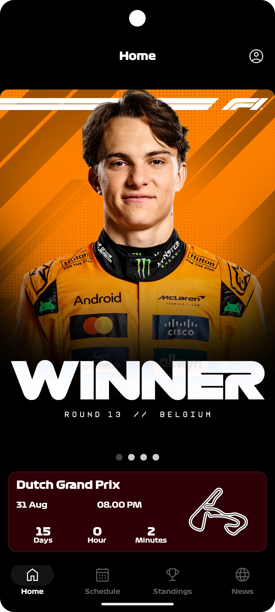
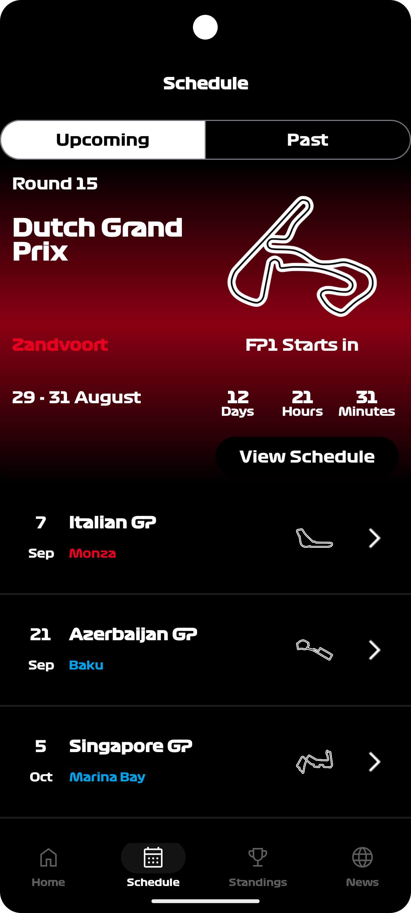
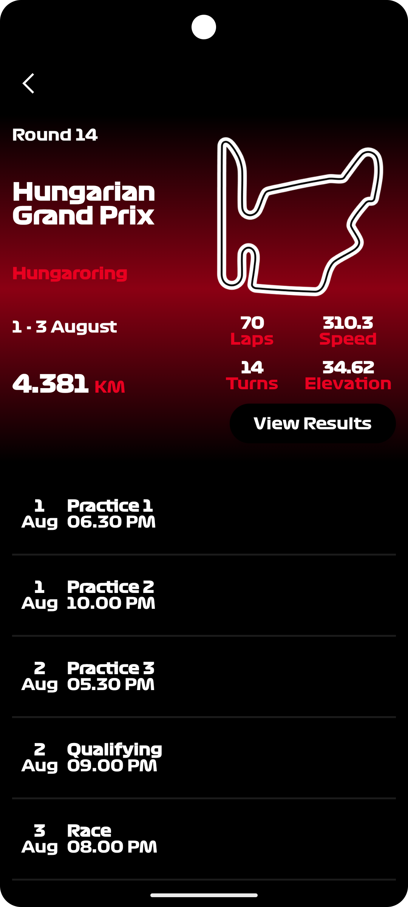
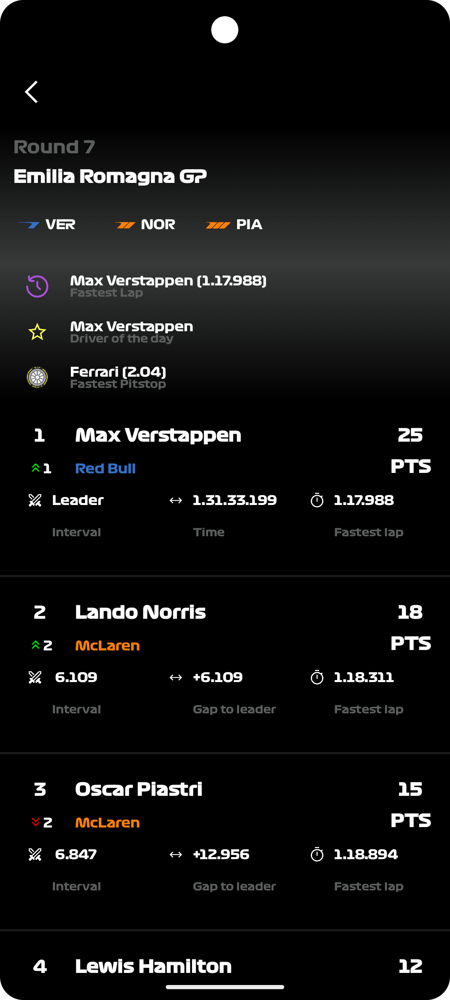
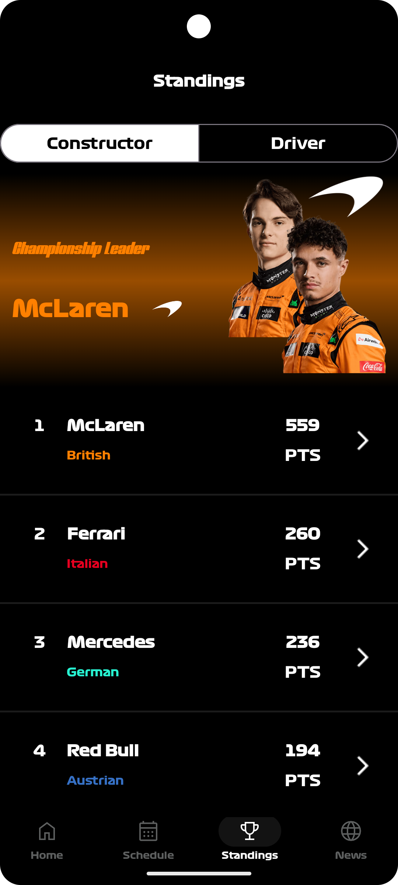

# OversteerFormula1App


> If you like this project, consider giving it a ⭐ on GitHub — it helps others discover it too!

**OversteerFormula1App** is an open-source Android project built with **Kotlin** and **Jetpack Compose**, designed to provide Formula 1 fans with race schedules, standings, race results news, and live updates.  

This is the **first complete version** of the project 🚀

---

## 📸 Screenshots
<p align="center">
  
  
  
  
  
  
</p>

---

## 🚀 Tech Stack
- **Language:** Kotlin  
- **UI:** Jetpack Compose  
- **Architecture:** MVVM + Clean Architecture  
- **Navigation:** Navigation-Compose with animated transitions  
- **State Management:** ViewModel + Coroutines + StateFlow  
- **Backend:** Supabase (data & auth)  
- **Push Notifications:** Firebase Cloud Messaging  
- **Offline Support:** Room + DataStore  
- **Dependency Injection:** Hilt  
- **Build System:** Gradle (KTS)  

---

## 📂 Modules
- `app` → Home and navigation host  
- `settings` → App settings  
- `authentication` → User login and register  
- `standings` → Constructor & Driver standings  
- `news` → F1 news and updates  
- `schedule` → Races schedule  
- `result` → Race results  
- `network` → Supabase integration  
- `notifications` → Push notifications  
- `design` → Theming (colors, typography, shapes, sizes)  
- `datasource` → Local & remote data handling  
- `utilities` → Shared utils and helpers  

---

## 📡 API
We use the [Jolpica F1](https://github.com/jolpica/jolpica-f1) as the primary data source.

---

## 🛠️ Getting Started
1. Clone the repository:
   ```bash
   git clone https://github.com/yourusername/OversteerFormula1App.git
2.Open in Android Studio (Arctic Fox or newer).
3.Add your google-services.json for Firebase inside the app/ module.
4.Build & run the project 🚀

---

## 📖 Documentation

Our documentation is available in the [docs/](./docs) folder. It covers:

- [Project architecture](./docs/architecture.md) → Overview of all modules & architecture diagram
- [API integration](./docs/api.md)  → How API is called, endpoints used
- [Database schema & offline support](./docs/database.md)  → Room & DataStore schema, offline support
- [Dependency injection setup](./docs/di.md) → Hilt setup & dependencies
- [Authentication integration](./docs/authentication.md)  → How login/register works
- [Notification system](./docs/notifications.md) → Firebase + Supabase notifications

---

## 🐞 Reporting Bugs / Contributing

- Fork the repo & create a feature branch  
- Make your changes with clear commit messages  
- Open a PR describing your changes  

Please also check our [CONTRIBUTING.md](./CONTRIBUTING.md).

---

## 📄 License

This project is licensed under the MIT License – see the LICENSE file for details.

---

## 🌍 Community

If you build something cool with OversteerFormula1App, feel free to open a PR to add it to our community list.

If you find this project useful, consider giving it a ⭐ to support development.

---

## ​ Credits

Big thanks to the amazing folks behind [Jolpica F1](https://github.com/jolpica/jolpica-f1) for providing the API that powers the data in this app 🙌

---

## 👨‍💻 Maintained by Hugo


