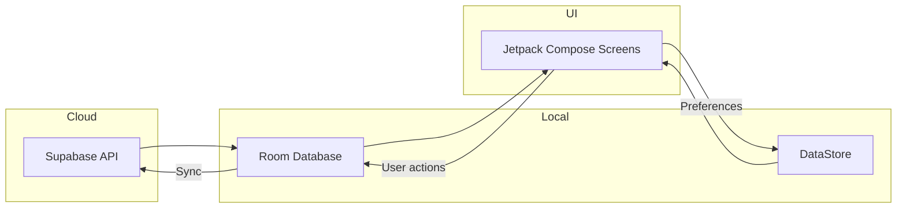

# Database Design

## Overview
This project uses a **hybrid storage approach**:
- **Supabase** (PostgreSQL) for cloud-hosted relational data.
- **Room Database** for local offline caching on the device.
- **DataStore** for lightweight key-value storage (e.g., user preferences, tokens).

The goal is to provide **offline-first support**, ensuring that users can still access key app data even without a network connection.

---

## Supabase Database

### ER Diagram
📸
<p align="center">
  <a href="https://dbdocs.io/L%C3%AA%20D%C5%A9ng/OversteerF1?view=relationships">
    
  </a>
</p>

[Click here to view the database online](https://dbdocs.io/L%C3%AA%20D%C5%A9ng/OversteerF1?view=relationships)


### Key Tables
| Table              | Description |
|-------------------|---------------------------------------------------------|
| `CircuitDetails`   | Stores detailed information about F1 circuits, podiums, fastest laps, and facts. |
| `ConstructorDetails` | Stores constructor teams, drivers, stats, chassis, power units, and championship info. |
| `DriverDetails`    | Stores driver stats, info, first entry, wins, podiums, WDC, and images. |
| `HomeDetails`      | Holds images and info for the home screen (race & standings overview). |
| `Races`            | Stores race details such as circuit, name, date, and time. |
| `Profiles`         | User profiles linked to auth.users table (display name, avatar, bio, email). |
| `DeviceToken`      | Stores FCM tokens, platform info, notification preferences, and active status. |
| `Notification`     | Stores notifications sent to users, status, stage, and associated race. |

### Relationships & Notes
- `Profiles` and `DeviceToken` reference `auth.users(id)` from Supabase Auth.
- `Notification` references `Races(id)` and `auth.users(id)`.
- All primary keys are explicitly defined; some tables use `uuid` or text identifiers.
- `DeviceToken` supports multiple notification preferences (race reminders, breaking news, etc.).
- **Edge Functions** use these tables to send FCM notifications progressively (7 days, 1 day, 15 minutes).

---

## Jolpica Database

### ER Diagram
📸
[📸 View Supabase ER Diagram](https://dbdocs.io/L%C3%AA%20D%C5%A9ng/OversteerF1?view=relationships)  


[Click here to view the database online](https://dbdocs.io/jolpica/jolpica-f1?view=relationships)


- Contains **external Formula 1 data**.
- Acts as a **read-only source**, fetched via API and cached locally.
- Synced periodically with Supabase/local Room for consistency.

---

## Local Database (Room)

### Purpose
- Provides **offline caching** of frequently accessed data.
- Improves app performance by reducing redundant network calls.

### Entities
| Entity        | Description                                      |
|---------------|--------------------------------------------------|
| `DriverEntity`| Stores driver standings and metadata             |
| `TeamEntity`  | Constructor standings and info                   |
| `NewsEntity`  | Cached news articles                             |
| `RaceEntity`  | Race schedule and results                        |

### Strategy
- **On fresh app launch** → API fetch → cache in Room.
- **Subsequent navigations** → read from Room first, fallback to API only if necessary.

---

## DataStore

### Usage
- Store lightweight key-value data such as:
    - `id_token`
    - `user_id`
    - `email`
    - `display_name`
    - `profile_picture_url`
    - user preferences (e.g., dark mode, notifications enabled)

### Example
```kotlin
val ID_TOKEN = stringPreferencesKey("id_token")
val USER_ID = stringPreferencesKey("user_id")
val EMAIL = stringPreferencesKey("email")
val DISPLAY_NAME = stringPreferencesKey("display_name")
val PROFILE_PICTURE_URL = stringPreferencesKey("profile_picture_url")
```
---

## Sync & Offline-First Strategy
- **Room** is the primary source for UI rendering.  
- **Supabase API** is queried periodically or on demand to update Room.  
- **DataStore** holds persistent session and preference data.  
- Conflict resolution is handled by **last-write-wins** (server timestamp prioritized).  

### Offline-First Data Flow


---

## Future Improvements
- Add **background workers** (WorkManager) for periodic sync.  
- Implement **sophisticated cache invalidation** strategies.  
- Add **migration scripts** for Room database evolution.  
